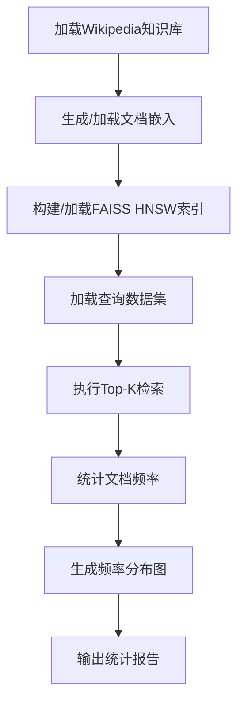

# hotpaper-text

一个基于RAG（检索增强生成）的文档热度分布分析工具，用于分析不同查询数据集下文档检索的频率分布模式。

## ? 项目简介

本项目实现了一个完整的RAG系统分析工具，用于研究在不同查询数据集上检索Wikipedia文档时的热度分布规律。使用先进的BAAI/bge-large-en-v1.5嵌入模型和FAISS HNSW索引技术进行高效的语义检索与统计分析。

## ? 核心功能

- ? **多数据集支持**: 支持MMLU、Natural Questions、HotpotQA、TriviaQA等主流问答数据集
- ? **频率分析**: 统计文档检索频率分布，识别"长尾分布"模式
- ? **灵活的Top-K**: 支持不同的检索数量配置
- ? **可视化**: 生成Log-Log尺度的频率分布图表
- ? **高效检索**: 使用FAISS HNSW索引实现快速语义相似度搜索
- ? **组合分析**: 分析文档组合的有序和无序检索模式
- ? **跨数据集对比**: 支持多数据集结果对比分析

## ?? 技术栈

| 组件 | 技术 | 说明 |
|:---|:---|:---|
| **嵌入模型** | BAAI/bge-large-en-v1.5 | 1024维，专为RAG优化的文本嵌入模型 |
| **向量数据库** | FAISS HNSW | 高效的近似最近邻搜索索引 |
| **知识库** | rag-mini-wikipedia | Wikipedia的子集数据 |
| **可视化** | Matplotlib | 生成Log-Log尺度的频率分布图 |
| **数据处理** | Pandas, NumPy | 数据集处理和数值计算 |
| **数据集加载** | datasets | HuggingFace datasets库 |

## ? 安装与使用

### 环境要求

- Python 3.7+
- 推荐内存 8GB+
- NumPy 1.x版本（兼容FAISS）

### 依赖安装

```bash
pip install -r requirements.txt
```

### 核心脚本使用

#### 1. 文档频率分析 (`hot.py`)

分析单个文档在检索中的热度分布：

```bash
# 基本用法
python hot.py --dataset [mmlu|nq|hotpotqa|triviaqa] --topk [K]

# 示例命令
python hot.py --dataset mmlu --topk 1       # MMLU数据集，Top-1文档
python hot.py --dataset nq --topk 5         # Natural Questions，Top-5文档
python hot.py --dataset hotpotqa --topk 10  # HotpotQA，Top-10文档
python hot.py --dataset triviaqa --topk 1   # TriviaQA，Top-1文档
```

#### 2. 文档组合分析 (`hotpair.py`)

分析文档组合的有序和无序检索模式：

```bash
# 基本用法
python hotpair.py --dataset [mmlu|nq|hotpotqa|triviaqa] --topk [K]

# 示例命令
python hotpair.py --dataset mmlu --topk 3
python hotpair.py --dataset nq --topk 5
```

#### 3. 跨数据集图表生成 (`draw_combo_chart.py`)

生成跨数据集的对比分析图表：

```bash
python draw_combo_chart.py  # 自动读取已生成的统计文件
```

### 支持的数据集

| 数据集 | 标识符 | 描述 |
|:---|:---|:---|
| MMLU | `mmlu` | Massive Multitask Language Understanding |
| Natural Questions | `nq` | Google自然问题数据集 |
| HotpotQA | `hotpotqa` | 多跳推理问答数据集 |
| TriviaQA | `triviaqa` | 百科知识问答数据集 |

### 输出文件说明

#### 单文档分析输出 (`hot.py`)

- `output/charts/hot_docs_distribution_{dataset}_top{k}.png`: 文档频率分布可视化图表
- `data/stats/freq_stats_{dataset}_top{k}.txt`: 详细频率统计信息，包含Top-10热门文档

#### 组合分析输出 (`hotpair.py`)

- `output/charts/ordered_combo_distribution_{dataset}_top{k}.png`: 有序组合频率分布图
- `output/charts/unordered_combo_distribution_{dataset}_top{k}.png`: 无序组合频率分布图
- `data/stats/ordered_combo_stats_{dataset}_top{k}.txt`: 有序组合统计信息
- `data/stats/unordered_combo_stats_{dataset}_top{k}.txt`: 无序组合统计信息

#### 系统文件

- `doc_embeddings.npy`: Wikipedia文档嵌入（首次运行生成）
- `hnsw_index.bin`: FAISS HNSW索引文件（首次运行生成）

## ? 项目结构

```
hotpaper-text/
├── data/stats/           # 统计结果文件夹
│   ├── ordered_combo_stats_*.txt
│   └── unordered_combo_stats_*.txt
├── output/charts/        # 图表输出文件夹
├── hot.py               # 核心分析脚本
├── hotpair.py           # 组合分析脚本
├── draw_chart.py        # 单数据集图表绘制
├── draw_combo_chart.py  # 跨数据集对比图表
├── dateset.py           # 数据集加载模块
├── requirements.txt     # Python依赖
├── commands.txt         # 示例命令
└── README.md           # 项目文档
```

## ? 应用场景

本工具可以帮助研究者：

1. **识别热门检索文档**: 发现RAG系统中被频繁检索的Wikipedia文档
2. **分析分布模式**: 通过Log-Log图观察是否遵循长尾分布
3. **评估检索多样性**: 了解检索结果的集中程度
4. **优化RAG系统**: 基于热度分布规律改进检索策略
5. **跨数据集比较**: 分析不同问答数据集的检索特性差异

## ? 技术原理

### 工作流程



### 核心算法

1. **语义嵌入**: 使用BAAI/bge-large-en-v1.5模型将文档和查询转换为1024维向量
2. **相似度检索**: 利用FAISS HNSW索引进行高效的近似最近邻搜索
3. **频率统计**: 统计每个文档ID在所有查询检索结果中的出现频次
4. **分布分析**: 使用Log-Log坐标系可视化频率分布，识别长尾特性

## ?? 注意事项

- **首次运行**: 需要下载并生成Wikipedia数据集的嵌入，预计需要较长时间
- **内存要求**: 嵌入文件和索引文件较大（约25MB+），推荐8GB+内存环境
- **NumPy版本**: 必须使用NumPy 1.x版本，因为FAISS模块与NumPy 2.x不兼容
- **模型缓存**: 优先使用本地缓存的HuggingFace模型（如果存在）
- **文件编码**: 部分统计文件可能使用GB2312编码，读取时需注意

## ? 故障排除

### 常见问题

1. **NumPy版本冲突**: 降级到NumPy 1.x版本
2. **内存不足**: 增加系统内存或使用更小的数据集
3. **模型下载失败**: 检查网络连接或使用本地模型缓存
4. **中文显示问题**: 确保安装了SimHei或Microsoft YaHei字体

## ? 许可证

本项目使用MIT许可证 - 详见LICENSE文件。

## ? 贡献

欢迎提交Issue和Pull Request来改进项目。

## ? 联系

如有问题或建议，请通过GitHub Issues联系。